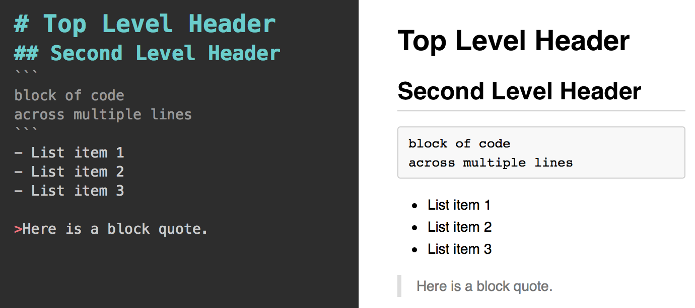
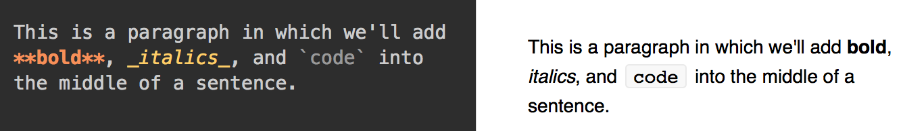
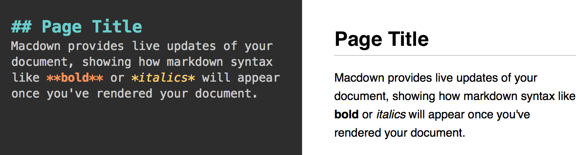

# Module 3: Markdown

## Overview
Markdown syntax provides a simple way to describe the desired formatting of text documents. In fact, all of the learning modules (including this one you're reading) were written using Markdown! With only a small handful of options, Markdown allows you to provide structure to a document, as well as formatting to your text (like **bold**, or _italics_). There are a number of programs that support the rendering of Markdown, including GitHub, Slack, and StackOverflow (note: the syntax implementation may vary slightly across programs). In this section, you'll learn the basics of Markdown syntax, and how to leverage it.

<!-- START doctoc generated TOC please keep comment here to allow auto update -->
<!-- DON'T EDIT THIS SECTION, INSTEAD RE-RUN doctoc TO UPDATE -->
**Contents**

- [Resources](#resources)
- [Writing Markdown](#writing-markdown)
  - [Document Structure](#document-structure)
  - [Text formatting](#text-formatting)
- [Rendering Markdown](#rendering-markdown)
  - [Markdown Reader (Chrome Extension)](#markdown-reader-chrome-extension)
  - [Online Editors](#online-editors)
  - [Macdown](#macdown)

<!-- END doctoc generated TOC please keep comment here to allow auto update -->

## Resources
- [Original Markdown Source](https://daringfireball.net/projects/markdown/)
- [GitHub Markdown Basics](https://help.github.com/articles/basic-writing-and-formatting-syntax/)
- [Slack Markdown](https://get.slack.help/hc/en-us/articles/202288908-Formatting-your-messages)
- [StackOverflow Markdown](http://stackoverflow.com/editing-help)
- [Markdown Reader Chrome Extension](https://chrome.google.com/webstore/detail/markdown-reader/gpoigdifkoadgajcincpilkjmejcaanc?hl=en)

## Writing Markdown
Markdown is an easy to write (and easy to read) syntax for declaring document structure and formatting. In the text-editor of your choice, you can add Markdown syntax to plain text to provide your writing with structure and emphasis.

### Document Structure
Markdown isn't just about adding **bold** and _italics_ to your paragraphs - it enables you to create distinct sections of your page, such as a header or a block of code. Markdown is most easily explained through example, so let's take a look at how a few simple approaches can produce a thoroughly formatted document (code on the left, rendered version on the right):



As you can see, the document (right) is produced using the following Markdown shorthand:


| Symbol | Format	|
| ------------- |  ------------- |
| `#`| Top level header (`##` for 2nd level header, ... ,`######` for 6th level header)	|
| ```	| Code section	|
| `-`	| Unordered list item	|
| `>` | Block quote	|

And as you can see, Markdown can even make tables!

### Text formatting
In addition to lending structure to your documents, the use of Markdown allows you to declare text formatting options. Let's take a look at another example:



| Symbol | Format	|
| ------------- |  ------------- |
| ``` `WORD` ``` | Inline code element	|
| `**WORD**`	| Bold	|
| `_WORD_`	| Italics	|

For more thorough lists of Markdown options, see the online [resources](#resources) linked above. To practice your Markdown skills, see [exercise-1](exercise-1) and [exercise-2](exercise-2).

## Rendering Markdown
In order to view the rendered version of your Markdown sytax, you need to use a program that converts from Markdown into a formatted document. Luckily, GitHub will automatically render your `README.md` files, and Slack/StackOverflow will automatically format your messages. However, it can be helpful to preview your rendered markdown before pushing your code. Here are a few options to do so:

### Markdown Reader (Chrome Extension)
There are a number of Google Chrome Extensions that you can install that will render Markdown files for you. One which I've found useful is [Markdown Reader](https://chrome.google.com/webstore/detail/markdown-reader/gpoigdifkoadgajcincpilkjmejcaanc?hl=en), which provides you with a simple rendering of a Markdown file (note, it may differ slightly from the way GitHub would render the document). Once you've installed the Extension, you can drag + drop a `.md` file into a blank Chrome tab to view the formatted document. Double-click to view the raw code.

### Online Editors
There are a variety of Markdown editors online that you can use to practice Markdown. This isn't likely how you'll want to write your code, but they're a fun sandbox to get started. One I've found easy to use is [dillinger](http://dillinger.io/), though there are plenty if you are looking for something more specific.

### Macdown
Macdown is a program (for Macs only, unfortunately) that is designed for writing Markdown documents. It's biggest advantage is that it provides a live view of how your Markdown document will be rendered:



Download [here](http://macdown.uranusjr.com/).
